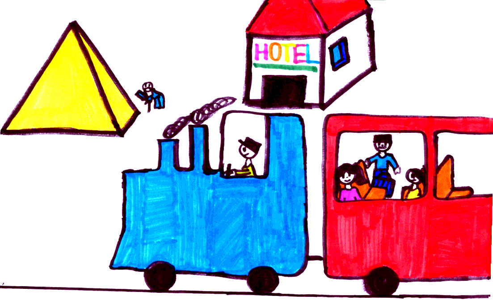

# Zadání

Hlavní postava: panovačný pán po čtyřicítce, vedlejší postava: mladá citlivá dívka, místo děje: školní třída, prostředí: zasněžené město o Vánocích, ostatní: hlavní postavě pomáhá jeho nejlepší přítel, (BONUS) Historická postava: faraon Taharka, 690-664 BC, Egypt

# Cestování

Byl jedou jeden kluk, který se jmenoval Kuba Hulta. Ráno ve třídě místo hraní kreslil mapu a na ní červený čárky. Jeho kamarád se ho ptal, co to dělá, ale Kuba mu neodpověděl. On totiž Kuba chtěl jet do Egypta až bude velký. Po pár letech, když mu bylo skoro 40 let, se přestěhoval do malého města. Všude byl sníh, protože byly Vánoce. Po pár týdnech začal být panovačný a jel do Egypta. Ve vlaku po chvíli přišel revizor, a zeptal se mladé dívky na lístek. Ta dívka se koukala, jestli ten lístek nemá v tašce. Pak zjistila že ho nemá, postavila se a zeptala se, kolik to bude stát. “5000 KČ“, odpověděl jí revizor. „Ale tolik nemám!“, vykřikla vyděšeně. Když to Kuba viděl, přišel tam a řekl, že to zaplatí za ní. Revizor kývnul a Kuba mu zaplatil. Revizor šel dál. „Mockrát vám děkuju!“, usmála se na něj slečna. Kuba se k ní posadil a představil se: „Dobrý den, jmenuji se Kuba Hulta, ale spíš mi říkají pan Hulta.“ „Těší mne. Mně říkají Hanka. A kam to jedete pane Hulto?“ „Do Egypta.“ „Já také! A jako co pracujete, pane?“ Zkoumám pyramidy.“ „Já zase sbírám památky!“ „Tak můžeme pracovat spolu!“ „Dobrý nápad!“ Po chvíli prohlásil průvodčí, že dorazili do Egypta a že tu ten vlak končí.

Když vyšli, viděli hotel, a tak se tam vydali. Druhý den, když šli do jedné pyramidy. Seděl tam starý pán. „Co tu děláte?“, zeptal se pan Hulta. „Sedím a čekám, ani nevím na co“, odpověděl starý pán. „A jak se jmenujete?“, zeptala se Hanka. „Jmenuji se Faraon Taharka. Jsem docela slavný, ale hodně lidí mě ani nezná. Už jsem docela starý, je mi 99.“ „A bydlíte někde?“, přerušila ho Hanka. „Ne, nemám dost peněz na to, abych si koupil dům.“ „Tak můžete jít k nám do hotelu!“, navrhnul Hulta. Poté se všichni tři vydali do hotelu. Další dny všichni hledali památky z pyramid a našli jich hromadu. Pátého dne večer, kolem šesté hodiny, Taharka zemřel. Hulta a Hanka brečeli a naříkali. A protože byl na ně hodný a napůl slavný, postavili mu památeční sochu, kterou schovaly do pyramidy. A hádejte, kdo to takhle rozkázal…? Hulta!!! (jestli si pamatujete, v sedmé větě je napsáno, že byl panovačný, a proto to tak muselo být 😊). Po pár letech se nějací dva pánové do té pyramidy, kde byla schovaná taharkova socha, dostali. Socha se jim ale nelíbila, a proto ji chtěli zničit. Zabydleli se v tom stejném hotelu, jako Hulta s Hankou. Když ti dva zlodějové vynesli sochu před pyramidu, aby ji zničili, uviděl je z dálky Hulta. Rychle to běžel říci Hance. Poté oba běželi dolů, a zeptali se, proč tu sochu ničí. Oni jim odpověděli, že se jim ta socha prostě nelíbí, a navíc ani nevědí, od koho ta socha je. „No přece od Taharka!“, vykřikla Hanka. „Jooo! Taharka! Toho známe! On zemřel?“ „Přesně tak ☹“, zaslzela Hanka. „No tak my ho vrátíme zase zpátky do té pyramidy. To se omlouváme!“ A hned jak tu sochu vrátily, skamarádili se. A od těch pradávných časů se té sochy nikdo nedotkl, a nikdo do té pyramidy již nevlezl.