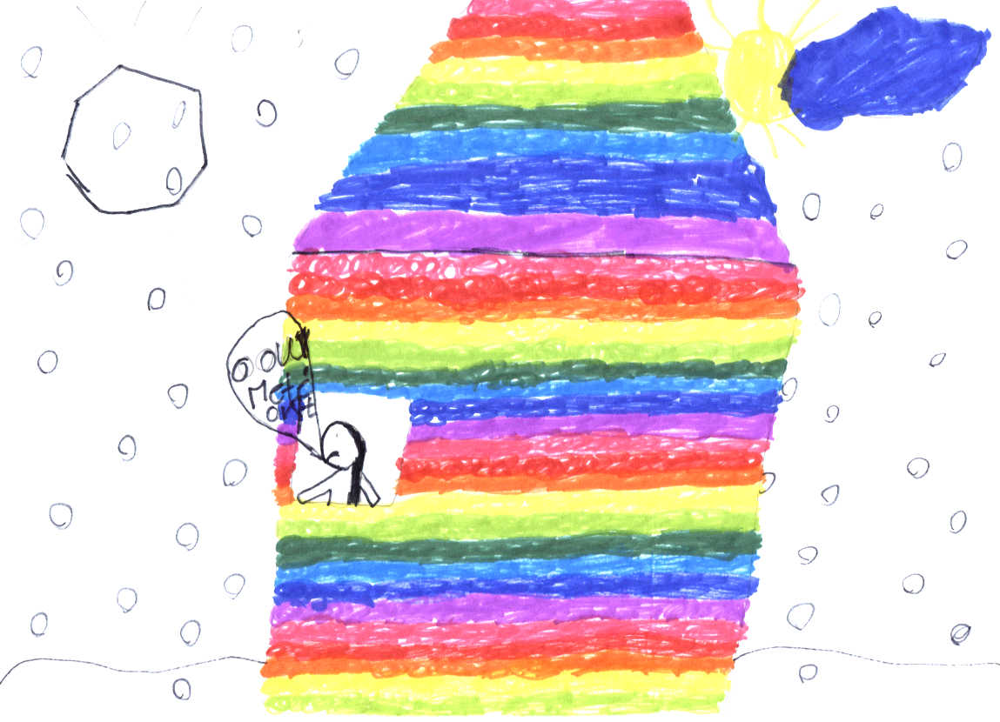

## Zadání

**main character:** panovačný pán po čtyřicítce

**vedlejší postava**: mladá citlivá dívka

**místo děje:** školní třída

**prostředí:** zasněžené město o Vánocích

**téma:** odpočítávání blížící se katastrofy

**ostatní:** hlavní postavě pomáhá s vyšetřovaním jeho nejlepší přítel

**historická postava (bonus):** faraon Taharka, 690-664 BC, Egypt

Byl jednou jeden pán po čtyřicítce, který chtěl, aby všechno bylo tak jak to řekne. Jmenoval se pan Mc´Donald. Byl to pan učitel na vysoké škole. Učil poprvé a byl hrozně zvědavý. Když šli všechny děti do třídy, hned se zamiloval do jedné krásné mladé dívky. Úplně měl oči ze srdíček. Když začal učit, řekl ať si všichni sednou do kroužku, aby řekli svá jména. Schválně řekl, aby začala právě ta mladá dívka. Začala mluvit, a řekla, že se jmenuje Sára. Potom byl na řadě někdo jiný, a všichni řekli své jméno. Potom se učili o biologii. Ta byla trošku těžká a žáci dělali mnoho chyb. Pan učitel se dokonce trošku zlobil, protože žáci vysoké školy už by měli tuto látku znát. Jenom na Sáru se nezlobil, protože ona jediná všechno uměla. Potom měli pauzu a pan učitel si se Sárou povídal. Potom se Sára koukla z okna na zasněžené město a Najednou vidí že na ně padá velikánský meteorit.
 
 
 Rychle vzala pana učitele za ruku a utíkali se schovat do sklepa. Poté uslyšeli náraz meteoritu, ale nebyl nijak veliký. Jen trochu to s nimi drnclo, a to bylo vše. Když vylezli, najednou byli v Egyptě. To byl tedy šok. Rozhlíželi se, ale všude kolem byla jen poušť. Najednou potkali pána, který se se jim představil jako faraon Taharka. Měl prý velikou armádu, a právě se chystal na obranu svého města Théby, které chtěli napadnout Asyřané. Sára a Mc´Donald mu nabídli své služby. Sára se mohla především starat o nemocné nebo zraněné vojáky. Sára totiž byla učila na doktorské škole a náhodou u sebe měla i doktorské náčiní. Jenže poté začal být Mc´Donald panovačný a říkal, že faraon nebude pomoc potřebovat, a že se nikdo nezraní. Nakonec si však dal říci a nechal toho. V tom uviděli na obzoru asyrskou armádu, která se k nim pomalu blížila. Rychle probudili své egyptské vojáky, aby se připravili k boji. Ale najednou co to? Ta zlá asyrská armáda utekla, a nikdo nevěděl proč. Až mnohem později se zjistilo, že mezi asyrskými vojáky propukl mor. To byla velice zlá nemoc, která jim vzala sílu a mnoho jich dokonce zabila. Po té vyhrané bitvě přespali v Egyptě pár nocí. Na dvoře faraona Tahraky sloužil kouzelník, který znal kouzlo, jak vrátit Sáru s Mc´Donaldem zpátky do svého času. Po pronesení pár tajemných zaříkadel se najednou oba ocitli zpátky ve své třídě. Až o pár dní později se z učebnic dějepisu dozvěděli, že ten hodný faraon Taharka proti Asyřanům nakonec stejně prohrál a musel utéci hluboko do Afriky, až do daleké Nůbije. Bylo jim ubohého faraona moc líto. Ale tak už to na světě chodí.